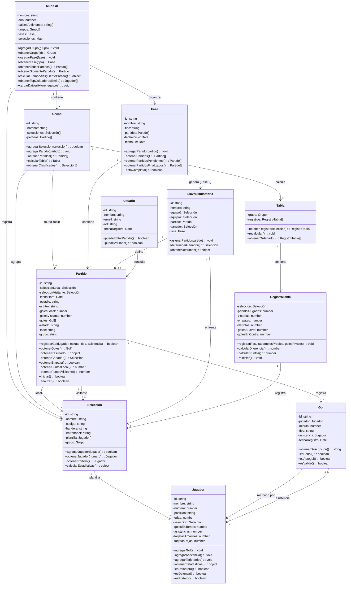

# Diagrama de clases - FIFA World Cup 2026 (Fase 1)

> Estado: Implementado en código (`/modelos`). Las 8 entidades del enunciado
> original (Usuario, Mundial, Grupo, Selección, Jugador, Partido, Gol, Fase)
> más LlaveEliminatoria, Tabla y RegistroTabla como clases de soporte.

